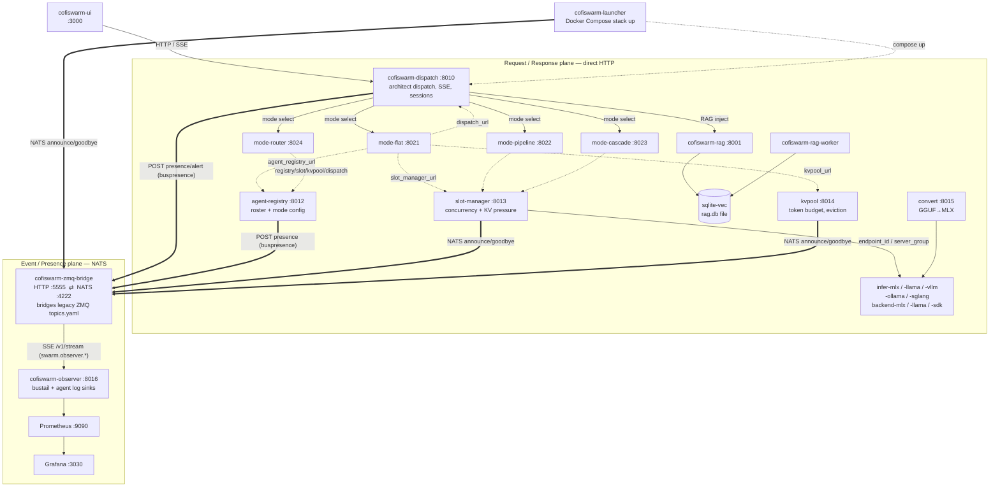

# Cofiswarm — Service / Bus Topology

Cofiswarm (`swarm-matrix`) is a set of independently-deployable processes — each with
its own `go.mod`/sidecar, FHS paths, and listen port — loosely coupled at the wire:

- **Request/response plane** — direct HTTP via config URLs (`dispatch_url`,
  `slot_manager_url`, `kvpool_url`, `agent_registry_url`), not Go-workspace imports.
- **Event/presence plane** — NATS (`:4222`) fronted by `cofiswarm-zmq-bridge`'s
  HTTP/SSE control plane (`:5555`); the observer tails the bridge **SSE** stream
  (`/v1/stream`) and needs no NATS client of its own.

This is why services like `agent-registry` and `slot-manager` are not in `go.work`:
coupling is at the wire, not the build.

## Ports (confirmed from source)

| Service | Port | Source |
|---------|------|--------|
| `cofiswarm-dispatch` | `:8010` | `cmd/cofiswarm-dispatch/main.go:18` (`-listen`) |
| `cofiswarm-agent-registry` | `:8012` | dispatch `internal/modes/relay.go:59` default |
| `cofiswarm-slot-manager` | `:8013` | dispatch `internal/compat/routes.go:95` default |
| `cofiswarm-kvpool` | `:8014` | `cmd/cofiswarm-kvpool/main.go:17` (`-listen`) |
| `cofiswarm-convert` | `:8015` | README / `cmd` |
| `cofiswarm-observer` | `:8016` | README / `cmd` |
| `cofiswarm-rag` | `:8001` | dispatch `internal/compat/routes.go:156` default |
| `cofiswarm-mode-flat` | `:8021` | README |
| `cofiswarm-mode-pipeline` | `:8022` | README |
| `cofiswarm-mode-cascade` | `:8023` | README |
| `cofiswarm-mode-router` | `:8024` | README |
| `cofiswarm-zmq-bridge` | `:5555` HTTP / `:4222` NATS | `internal/bus/nats.go` |
| RAG store | sqlite-vec `rag.db` (no port) | `cofiswarm-rag` `store_sqlite.py` |
| Prometheus / Grafana | `:9090` / `:3030` | `cofiswarm-grafana` README |
| `cofiswarm-ui` | `:3000` *(inferred)* | port scan |

## Topology

### NATS subjects (observed)

`swarm.observer.presence` · `swarm.observer.alert` · `swarm.observer.hello` ·
`swarm.observer.mode.*` · `swarm.observer.model.*` · wildcard tail `swarm.>`

## Caveats

- The **`:3000` UI port is inferred** from a port scan; all backend ports above are
  confirmed from source.
- The **mode → slot-manager → inference → backend** edges are the intended shape;
  the migration is mid-flight and several READMEs note `stub → full wiring sprint N`,
  so not all bottom-plane edges are necessarily live yet.
- Solid arrows = primary HTTP flow; dotted = config-URL calls from mode plugins;
  thick (`==>`) = event/presence publish onto the bus.
